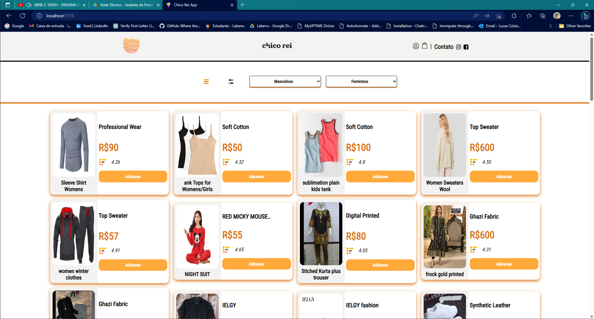

# Chico-Rei-System

Este projeto foi realizado como parte do processo seletivo para desenvolvedor e analista de sistemas JR na empresa CHICO REI, o desafio foi criado em duas partes, uma técnica e outra prática, e aqui, o presente projeto cumpre a parte prática e atende seus requisitos. Tal desafio exige que escolhamos uma API pública de escolha livre e através dela, é necessário buscar e criar dados em formas específicas.

1. Catálogo de produtos em Layout responsivo, contento cards especificações de cada objeto. Rota segue um sistema de paginação onde no máximo 15 produtos serão renderizados por página.
2. Roteamento de páginas que origatoriamente use Vue-Router, páginas devem mudar de acordo com a categoria de produto selecionado, assim como URL (Path)
3. Desenvolver menu lateral que abre de acordo com ícone em parte superior da aplicação, responsivo e de fácil acesso.
4. Página de finalização de pedidos, aqui, produtos na sacola serão postos de forma HardCoded. Todos inputs devem ser controlados e passar por uma série de validações (Data, CEP, Email e assim por diante). Considerando também que todos inputs serão obrigatórios.
5. Produtos na sacola devem ter quantidade selecionável e de fácil alteração.
6. Carregamento de CEP utilizando biblioteca cep-promise [CEP-PROMISE API](https://github.com/BrasilAPI/cep-promise)
7. Exibição de mensagem de sucesso em caso de sucesso (Todos requisitos e validações atendidos)
8. Ao fechar o pedido com sucesso, devemos ter objeto final printado em forma de console.log() na aplicação, apresentando usuário comprador e produto comprado.

## 📄 Descrição
1. CHICO REI System foi feita utilizando API pública chamada DummyJSON API, que oferece através de suas requisições uma série de objetos que podem simular perfeitamente um ambiente de e-commerce [DummyJson API](https://dummyjson.com/) (NOTA: Por ser uma API pública com grande número de requisições ao redor do mundo, renderização de cards pode demorar um pouco mais, diminuindo levemente a experiência do usuário). Por fim, temos uma aplicação que simula uma página de compras, e aqui temos acesso a múltiplos produtos renderizados em forma de cards, nos mesmos temos acesso à preços, imagens, descrições e taxa de popularidade. Já para parte de filtros foram criadas rotas para cada categoria (Masculinas e Femininas). Requisições consumidas com biblioteca AXIOS. Estilização utilizando biblioteca LESS.

2. Build e Deploy
- Para build e deploy foi escolhida a plataforma [Surge](https://surge.sh/)
- Para Acessar o projeto basta clicar aqui! [CHICO REI System](https://chicoreisystem.surge.sh/)

    ## ⚒️ Tecnologias

 
   
  &nbsp;
  
  &nbsp;
  
  &nbsp;
  
  &nbsp;
  
  &nbsp;
  
  

